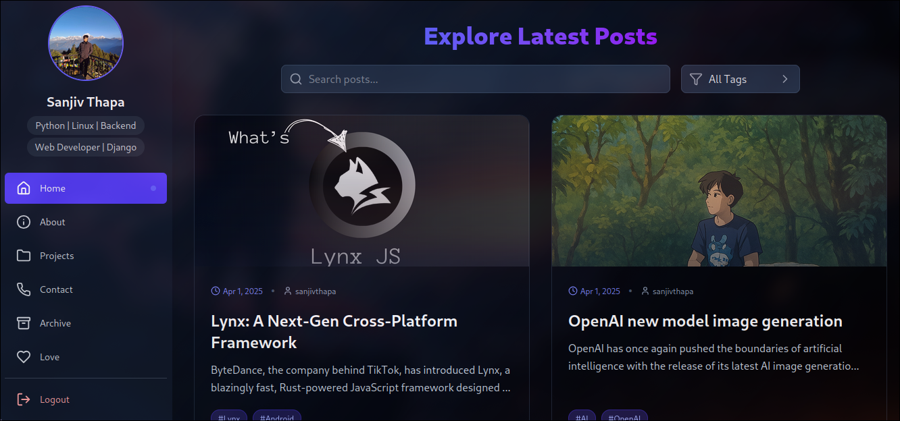
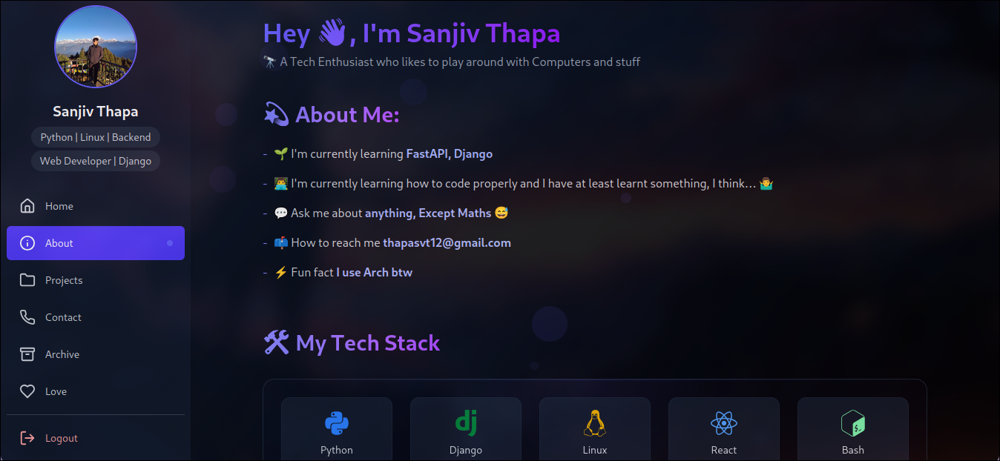
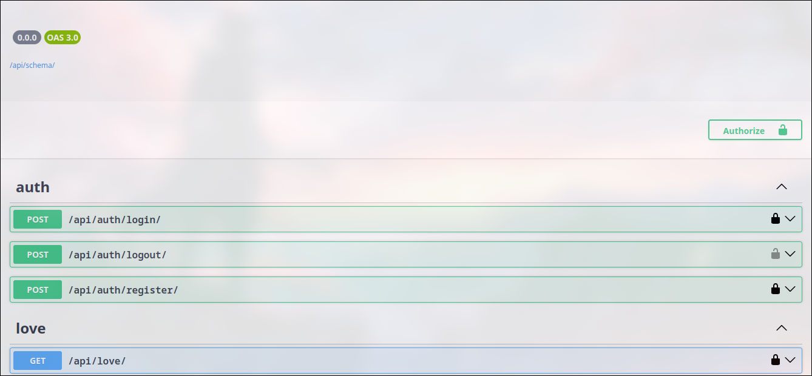

# 📝 Personal Blog Platform

A personal blog and portfolio site where you can publish your blogs, showcase your projects, and share a little bit about yourself.  
This platform includes an **About** page, **Projects**, **Contact**, **Archive**, and a **Love** page.

Built using modern web frameworks with full authentication, Markdown support, and a sleek frontend experience.

---

## 🚀 Features

- ✍️ **Blog Posts**: Create, read, update, and delete blog posts.
- 🔐 **Authentication**: Users must be authenticated to comment on posts.
- 📄 **Markdown Support**: Write your blog post descriptions in Markdown — they’ll render beautifully on the frontend.
- 📁 **Project Portfolio**: Showcase your personal or professional projects.
- ❤️ **Love Page**: A unique page to share passions, hobbies, or anything you love.
- 📬 **Contact Page**: Visitors can contact you through a clean, responsive form.
- 🗃 **Archive Page**: View all blog posts by date in a structured archive.
- 🧠 **About Page**: Tell visitors more about you.
- 📚 **API Documentation**: Automatically generated Swagger UI and ReDoc documentation for the backend API.
- ⚡ **Modern Tech Stack**:
  - **Frontend**: Vite + React
  - **Backend**: Django + Django REST Framework
  - **Database**: PostgreSQL or SQLite (configurable)

---

## 🔗 Live Demo

🌐 Check out the live demo here: [https://sanjiv-thapa.vercel.app/](https://sanjiv-thapa.vercel.app/)

---

## 🖼️ Screenshots

### 🏠 Home Page


### 🧠 About Page


### 🔧 API Docs (Swagger UI)



---

## 🛠️ Getting Started

### 📦 Frontend Setup

```bash
# Clone this repo
git clone https://github.com/sanjivthapasvt/blog-platform.git

# Change directory to frontend
cd blog-platform/frontend

# Install frontend dependencies
npm install

# Run the frontend dev server
npm run dev

# Add your API URL to .env
echo VITE_API_URL=http://127.0.0.1:8000/api >> .env
```

### ⚙️ Backend Setup

```bash
# Navigate to backend folder
cd ../backend/backend

# Create and activate virtual environment
python -m venv venv
source venv/bin/activate

# Install backend dependencies
pip install -r requirements.txt

# Create .env file with your database URL
touch .env
# Example: DATABASE_URL=postgresql://<username>:<password>%40%23@localhost:5432/<dbname>

# Run database migrations
python manage.py migrate

# Start backend server
python manage.py runserver
```

## 🤝 Contributing

Contributions are welcome! Here's how you can help:

1. Fork the repo
2. Create your branch (`git checkout -b feature/your-feature`)
3. Commit your changes (`git commit -am 'Add new feature'`)
4. Push to the branch (`git push origin feature/your-feature`)
5. Open a Pull Request

## 📜 License

You're free to use all or part of this codebase for your own projects. Please give proper credit by linking back to the original GitHub repository.

## 🙋‍♂️ Contact

Have questions, feedback, or ideas? Feel free to reach out via thapasvt12@gmail.com or open an issue in this repo.